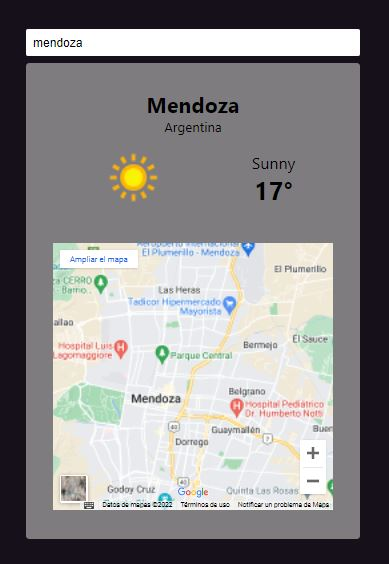

# REACT - WEATHER (CLIMA DE TU CIUDAD)

Mini proyecto con REACT JS usando Hooks y APIs de terceros.

Preview

## Contacto: 

Autor: Esteban Della Nave

Linkedin: https://www.linkedin.com/in/estebandellanave/

cv: https://drive.google.com/file/d/1fcjC2SMSHGzpMTnW0IH-2xzp_Cc3wKcv/view?usp=sharing

Email: estebandellanave@gmail.com 

movil: (+54) 294 434-9130

## Resumen: 

Es un formulario donde un usuario ingresa tareas para realizar y crea una lista que luego puoede ser editada. 

## Objetivos:

Objetivo 1: Crear un formulario con React JS.
